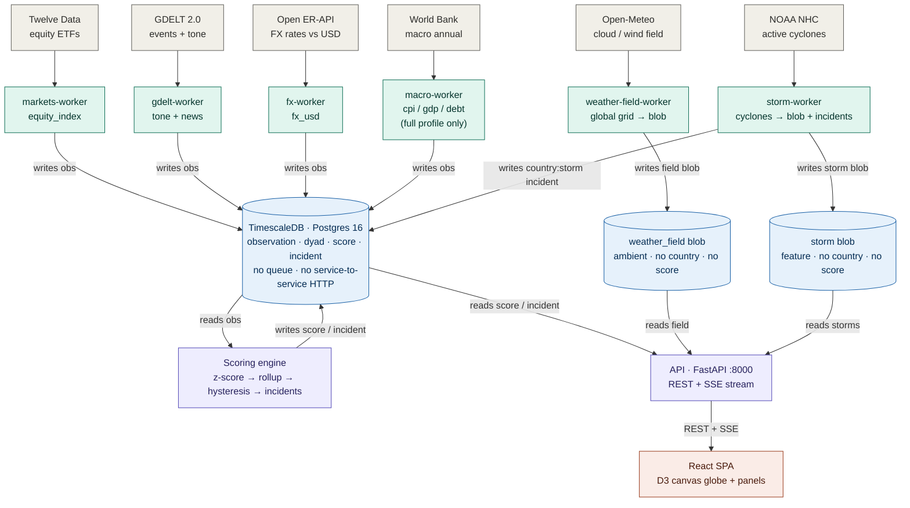

# GeoPulse — Architecture

GeoPulse is a local-first geopolitical/economic "health" dashboard. Ingestion
workers pull public data, a scoring engine turns it into per-country z-scored
states, a FastAPI service serves it, and a React canvas-globe frontend renders it
live — all against a single **TimescaleDB (Postgres 16)** database.

The defining choice: **the database _is_ the integration bus.** There is no
message queue and no service-to-service HTTP. Workers write raw observations;
the scoring engine reads them and writes derived scores back; the API reads
those. Every service is independently scheduled and fault-isolated.

## Tiers

### 1. External providers → ingestion workers

Four independent Python workers (all built from the same `services/Dockerfile`
image) each poll one public API on its own interval, rate-limited via a per-provider
token bucket and crash-isolated so a provider failure degrades scores to _stale_
rather than taking anything down.

| Worker           | Source (protocol)                        | Writes                                         | Default cadence          |
| ---------------- | ---------------------------------------- | ---------------------------------------------- | ------------------------ |
| `markets-worker` | Twelve Data `/time_series` (HTTPS, keyed) | `equity_index`                                 | `MARKETS_INTERVAL` 3600s |
| `gdelt-worker`   | GDELT 2.0 15-min export (HTTP)           | `gdelt_tone` (dyad) + `news_tone/goldstein/volume` | `GDELT_INTERVAL` 900s    |
| `fx-worker`      | open.er-api.com `/latest/USD` (HTTPS)    | `fx_usd`                                        | `FX_INTERVAL` 900s       |
| `macro-worker`   | World Bank API v2 (HTTPS)                | `macro_cpi`, `macro_gdp_growth`, `macro_debt_gdp` | `MACRO_INTERVAL` 86400s  |

> `macro-worker` runs only under the compose `full` profile; the default `lite`
> stack omits it. See [Deployment](#deployment-topologies).

### 2. TimescaleDB — the integration bus

A single Postgres 16 + TimescaleDB instance is the only shared state and the sole
integration point between services.

- **Hypertables:** `observation`, `dyad_observation` (raw signals, keyed by country/metric/ts).
- **Derived:** `score` (per country/domain, with an `inputs` jsonb for auditability),
  `domain_state` (hysteresis memory), `incident` (uuid + `dedup_key`, one active row per key).
- **`observation_daily`** continuous aggregate (refreshed every 5 min) backs cheap baselines.
- **Retention:** drop `dyad_observation` chunks > 90d; a `prune_highfreq` procedure trims
  `equity_index`/`fx_usd` > 90d — decades of macro history and the CAGG are preserved.

### 3. Scoring engine — the analytical core

Every `SCORING_INTERVAL` (300s) it reads all observations and, per country:

1. **Per-metric z-scores** vs a self-relative baseline (clamped to ±`CLAMP_Z`).
2. **Staleness discount** — `coverage = exp(-age / τ)` per metric.
3. **Weighted domain rollups** for `markets`, `economy`, `news`, plus `relations` (dyad-based).
4. **Hysteresis** — a state must hold `HYSTERESIS_N` (3) consecutive evals with asymmetric
   enter/recover bands before it commits (avoids flicker).
5. **Worst-of composite** over `{markets, economy, relations}` — **`news` is deliberately
   excluded** so it doesn't double-count GDELT, which already drives relations.
6. **Incident lifecycle** — opens/updates/resolves `incident` rows (dedup key `country:domain`).

Writes `score`, `domain_state`, `incident`. No network egress, no port.

### 4. API — FastAPI, read-only

Serves the derived data on port **8000** (CORS-enabled, `psycopg_pool` min 1 / max 6).
A background `poller()` diffs the DB every 3s and broadcasts changes over SSE.

| Method & path                          | Returns                                                    |
| -------------------------------------- | --------------------------------------------------------- |
| `GET /api/health`                      | `{status:"ok"}`                                            |
| `GET /api/tiles`                       | Latest composite state per country (globe choropleth)     |
| `GET /api/countries/{iso3}`            | Full breakdown: composite, domains, metrics, relations, incidents |
| `GET /api/incidents?status=…`          | Up to 100 incidents (`all`/`ongoing`/`resolved`)          |
| `GET /api/incidents/{id}`             | One incident incl. `detail` jsonb                          |
| `GET /api/arcs`                        | Top 80 tone-scored country dyads (relation arcs)          |
| `GET /api/stream`                      | **SSE** — `tile` and `incident` diff events (≤3s) + heartbeats |

### 5. Frontend — React SPA

React 18 + TypeScript + Vite. A D3-geo orthographic **canvas globe** renders a
choropleth from tiles, relation arcs, and decorative overlays.

- **`src/data/`** — a source-agnostic `DataSource` interface. `apiSource` (live) is
  selected when `VITE_API_BASE` is set, else static `fixtures` — the same UI runs on
  demo data or the live API interchangeably.
- **`LiveProvider`** owns tiles + incidents in memory, subscribes to `/api/stream`
  (SSE), auto-reconnects, and polls as a fallback.
- **`src/state/`** — a single `useReducer` store (selected country, active health
  metric, overlays, view). **`src/globe/`**, **`src/layout/`**, **`src/panels/`**,
  **`src/views/`** compose the chrome and detail panels.

## End-to-end data flow

1. Workers fetch from external APIs and write raw `observation` / `dyad_observation` rows.
2. The scoring engine reads those, computes z-scores → coverage → weighted domain
   rollups → hysteresis → worst-of composite → incidents, and writes `score` /
   `domain_state` / `incident` **back to the same DB**.
3. The API reads the derived rows and serves them as REST + an SSE diff stream.
4. The frontend renders the globe and, via SSE, patches tile/incident changes live.

## Key design decisions

- **Database as the integration bus** — no broker, no inter-service HTTP. Each worker
  is independently scheduled and fault-isolated; a failed cycle logs and continues.
- **Self-relative baselines** — each country is scored against its own recent history
  (z-scores vs `observation_daily`), not against other countries.
- **Hysteresis before commit** — state changes require N consecutive confirmations,
  suppressing single-cycle flicker.
- **`DataSource` abstraction** — the frontend runs on fixtures or the live API with no
  code change, degrading missing fields to _stale_ rather than crashing.
- **SSE with a polling fallback** — live updates without WebSocket infrastructure.
- **News as a standalone 5th domain** — scored and selectable, but excluded from the
  composite to avoid double-counting GDELT (the `add-news-domain` change; no DB migration,
  since `metric`/`domain` are free-text).

## Deployment topologies

Two ways to run the same services (see [README](README.md) for commands):

- **All-in-one image** (root [`Dockerfile`](Dockerfile)) — Postgres + all workers +
  scoring + API + nginx under supervisord in one container. nginx serves the SPA and
  reverse-proxies `/api/` (SSE included) to `127.0.0.1:8000`; only port 80 is exposed.
- **Multi-container** ([`docker-compose.yml`](docker-compose.yml)) — one container per
  service for local iteration. Profiles: `lite` (default, omits macro-worker) and
  `full`. The frontend also has a standalone Vite dev server on **5173**.

**Ports:** Postgres `5432` · API/uvicorn `8000` · frontend nginx `8080→80` (compose) or
`80` (all-in-one) · Vite dev `5173`.

---

_For the full treatment — quality goals, constraints, architecture decisions (ADRs),
quality scenarios, and risks/technical debt — see the [arc42 documentation](docs/arc42.md).
The per-milestone specs and design notes under [`openspec/`](openspec/) document how each
capability (ingestion, scoring, incidents, live updates, overlays, hardening) was built out._
