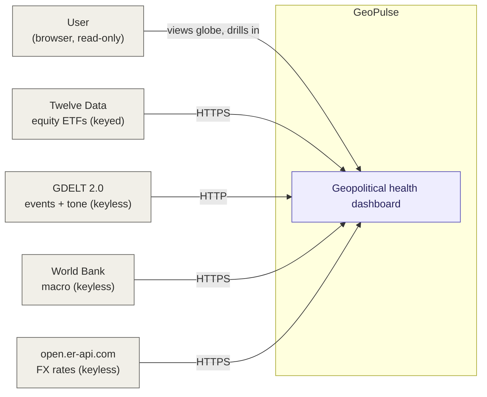
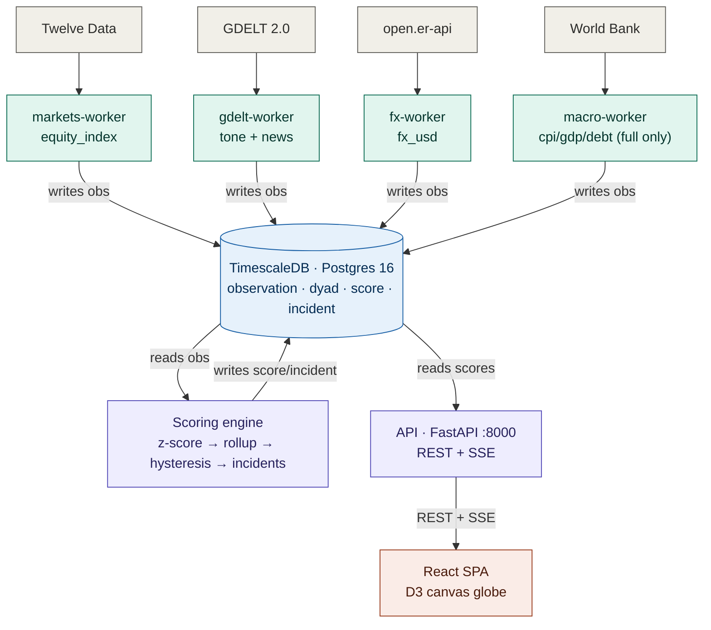
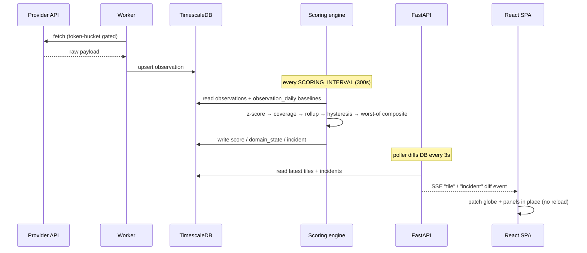
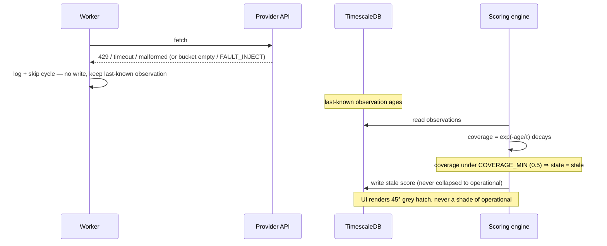
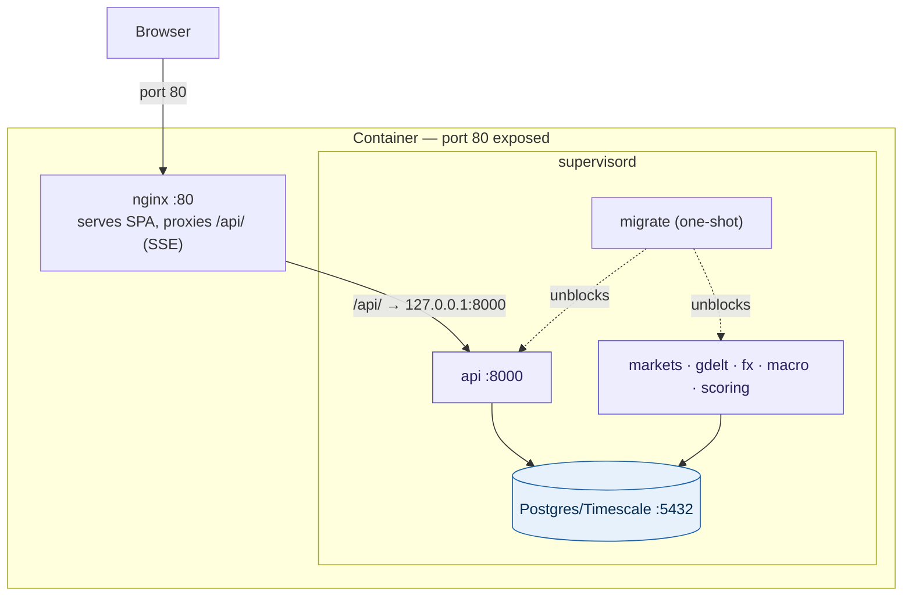

# GeoPulse — Architecture Documentation (arc42)

> Structured per the [arc42](https://arc42.org) template. This documents the
> **as-built** system as of 2026-07-11. The source of record for requirements and
> decisions is the OpenSpec workspace ([`../openspec/`](../openspec/)) and the
> project kickstart ([`../geopulse-openspec-kickstart.md`](../geopulse-openspec-kickstart.md));
> [`../ARCHITECTURE.md`](../ARCHITECTURE.md) is a condensed companion to this document.

## Table of contents

1. [Introduction and Goals](#1-introduction-and-goals)
2. [Architecture Constraints](#2-architecture-constraints)
3. [Context and Scope](#3-context-and-scope)
4. [Solution Strategy](#4-solution-strategy)
5. [Building Block View](#5-building-block-view)
6. [Runtime View](#6-runtime-view)
7. [Deployment View](#7-deployment-view)
8. [Crosscutting Concepts](#8-crosscutting-concepts)
9. [Architecture Decisions](#9-architecture-decisions)
10. [Quality Requirements](#10-quality-requirements)
11. [Risks and Technical Debt](#11-risks-and-technical-debt)
12. [Glossary](#12-glossary)

---

## 1. Introduction and Goals

GeoPulse is a **local-first geopolitical & economic "health" dashboard**. It gives a
single, calm, operations-console view of the world: ingestion workers pull public
data, a scoring engine turns each signal into a per-country state scored *against
that country's own baseline*, and a React canvas globe renders those states live.
The framing is deliberate — situational awareness ("what changed, when, and by how
much relative to that country's baseline"), **never editorial judgment disguised as
data**, and never prediction.

### 1.1 Requirements overview

| ID   | Requirement                                                                             |
| ---- | --------------------------------------------------------------------------------------- |
| FR-1 | **Globe view** — orthographic globe, choropleth of composite country states             |
| FR-2 | **Domain layers** — Economy, Markets, Relations (arcs), News; Conflict planned          |
| FR-3 | **Country drill-down** — composite, per-domain chips, key metrics, relations, incidents  |
| FR-4 | **Incident feed** — open/ongoing/resolved incidents with detail                          |
| FR-5 | **Staleness indicators** — source + age on every value; stale scores visually flagged   |
| FR-6 | **Methodology page** — the scoring disclosure (a launch blocker, see R-3)               |

### 1.2 Quality goals

The five driving quality attributes (see [§10](#10-quality-requirements) for testable scenarios):

| Priority | Quality goal              | What it means here                                                                                   |
| -------- | ------------------------- | ---------------------------------------------------------------------------------------------------- |
| 1        | **Local-first (NFR-1)**   | Whole stack runs on one machine; the only egress is to upstream public APIs. No cloud dependency.    |
| 2        | **Resilience (NFR-3)**    | Providers fail, throttle, or return junk without crashing anything — data degrades to *stale*, not error. |
| 3        | **Score stability (NFR-4)** | States don't flap: hysteresis holds a change for N evaluations before committing it.                |
| 4        | **Honesty & auditability (NFR-6)** | Self-relative baselines remove developed-market bias; every score decomposes to raw `(value, source, ts)`. |
| 5        | **Performance (NFR-2/5)** | Timely refresh (markets ≤5 min target, GDELT 15 min); <3 MB gzip load; 60 fps globe.                 |

### 1.3 Stakeholders

| Role                     | Concern                                                                        |
| ------------------------ | ------------------------------------------------------------------------------ |
| **Owner / maintainer**   | Coherent, spec-driven codebase; trivial local ops; reproducible on a fresh box. |
| **Primary user** (single, read-only) | A trustworthy "single pane of glass for the world" — calm, cartographic, honest about uncertainty. No accounts, no auth. |
| **Data providers** (external) | Their free-tier quotas and terms are respected (keyless-first, token-bucketed). |
| **Design reference**     | The AWS Health / Grafana / Datadog idiom; the `design_handoff_geopulse/` bundle is the pixel-level UI contract. |

---

## 2. Architecture Constraints

### 2.1 Technical constraints

| Constraint                          | Detail / rationale                                                                                          |
| ----------------------------------- | ---------------------------------------------------------------------------------------------------------- |
| **Single-host, local-first**        | Enforced as a spec invariant (deployment-profiles). Whole stack on one machine; egress only to data APIs.  |
| **Runtime versions**                | Python **3.12**, Node **20**, React **18**, TypeScript 5.5, Vite 5, TimescaleDB on **Postgres 16**.        |
| **One shared backend image**        | All workers + scoring + API + migrate run from `geopulse/services:local` ([`../services/Dockerfile`](../services/Dockerfile)). |
| **Free-tier / keyless-first APIs**  | GDELT, World Bank, open.er-api are keyless; Twelve Data is the one keyed provider (idles gracefully without a key). Quotas drive cadence. |
| **Podman/WSL friendly**             | Migrations are **baked into the image** (build context = repo root) to avoid bind mounts, unreliable on Podman/WSL on Windows. |
| **No CDN at runtime**               | Fonts self-hosted via `@fontsource` (IBM Plex); basemap via bundled `world-atlas`. Supports the local-first goal. |
| **LF line endings**                 | `.gitattributes` normalizes all text to LF; binary assets explicitly listed.                               |
| **Design fidelity**                 | `design_handoff_geopulse/GeoPulse.dc.html` is a normative pixel/hex/copy contract for the UI.              |

### 2.2 Organizational & convention constraints

- **Spec-driven development via OpenSpec.** Every capability is proposed → specced →
  implemented → archived under [`../openspec/`](../openspec/). Requirements carry
  stable IDs (FR-, NFR-, ADR-, R-, Q-) traceable from this document.
- **Migrations are checked in and idempotent** — the DB is reproducible on a fresh
  machine with no manual SQL.
- **Methodology transparency is a release gate** (R-3): composite scores must not ship
  without the methodology page, whose numbers are generated from the *same* config as
  the engine so the disclosure cannot drift.

---

## 3. Context and Scope

### 3.1 Business context

**In scope:** ingesting the four public sources above, scoring per-country state,
serving it, and visualizing it live on one machine.

**Out of scope (v1 non-goals):** forecasting, trading signals, per-company equity
data, mobile app, multi-user accounts/auth, and historical replay beyond 90 days.

### 3.2 Technical context — external interfaces

| Partner / interface        | Direction        | Protocol / format                    | Notes                                             |
| -------------------------- | ---------------- | ------------------------------------ | ------------------------------------------------- |
| Twelve Data `/time_series` | GeoPulse → out   | HTTPS JSON                           | Keyed (`TWELVE_DATA_KEY`); ~8/min free tier       |
| GDELT 2.0 export           | GeoPulse → out   | HTTP `lastupdate.txt` + `.CSV.zip`   | Keyless; 15-min cadence                           |
| World Bank API v2          | GeoPulse → out   | HTTPS JSON                           | Keyless; annual macro                             |
| open.er-api.com            | GeoPulse → out   | HTTPS JSON                           | Keyless FX vs USD                                 |
| Browser ↔ UI               | in ↔ out         | HTTP (static SPA) + **SSE**          | nginx serves the SPA and proxies `/api/`          |
| Browser ↔ API              | in ↔ out         | HTTP REST + `text/event-stream`      | Read-only; CORS-enabled                           |

---

## 4. Solution Strategy

The strategy is a set of deliberate choices that each serve a quality goal:

| Approach                                   | Serves                      | Summary                                                                                          |
| ------------------------------------------ | --------------------------- | ------------------------------------------------------------------------------------------------ |
| **Database as the integration bus**        | Local-first, simplicity     | No message queue, no inter-service HTTP. Workers write observations; scoring/API read them. One Postgres container. |
| **One worker process per source family**   | Resilience                  | Each worker has its own in-process scheduler and is crash-isolated — a stuck GDELT fetch can't delay markets. |
| **Self-relative z-scores** (ADR-003)       | Honesty                     | Each country scored against its own ≤90-day baseline → no developed-market bias.                 |
| **Hysteresis on transitions** (NFR-4)      | Stability                   | A state must hold N=3 evals, with asymmetric enter/recover bands, before it commits.             |
| **Worst-of composite** (ADR-005)           | Honesty (no averaging-away) | Composite = worst of available domains; per-domain chips preserve nuance.                        |
| **SSE, not WebSockets** (ADR-004)          | Simplicity                  | Updates are server→client and low-frequency; SSE is proxy-friendly and auto-reconnecting.        |
| **Continuous aggregate + 90-day retention**| Local-first, performance    | `observation_daily` backs baselines cheaply; high-frequency raw is pruned at 90 days.            |
| **Token buckets + fault-injection seam**   | Resilience                  | Providers stay within quota; degradation is exercised deterministically and degrades to *stale*. |
| **`DataSource` abstraction (frontend)**    | Testability, robustness     | UI runs on live API or static fixtures interchangeably; missing fields degrade to stale, not crash. |
| **Single all-in-one image + Compose profiles** | Ops simplicity          | One image and one compose file; profiles (`lite`/`full`) decide which workers start.             |

---

## 5. Building Block View

### 5.1 Level 1 — whitebox (the whole system)

| Building block   | Responsibility                                                                 | Key interfaces                                    |
| ---------------- | ------------------------------------------------------------------------------ | ------------------------------------------------- |
| **Ingestion workers** | Fetch one source family, normalize to `Observation`, upsert to the store  | out → provider HTTPS; write → `observation`/`dyad_observation` |
| **TimescaleDB**  | Sole shared state & integration bus; hypertables, aggregates, retention        | SQL (psycopg3)                                    |
| **Scoring engine** | z-score → coverage → domain rollup → hysteresis → worst-of composite → incidents | read/write DB                                     |
| **API (FastAPI)** | Read-only REST + SSE diff stream; 3-second DB poller                            | HTTP `/api/*`, SSE `/api/stream`                  |
| **Frontend (React SPA)** | Globe, panels, live updates via SSE with polling fallback               | HTTP/SSE → API                                    |

### 5.2 Level 2 — selected decompositions

**`services/common/`** (shared library, not a service) — [`../services/common/`](../services/common/):
`config.py` (all env-driven config) · `db.py` (psycopg3 wrapper, upserts) · `models.py`
(`Observation`, `DyadObservation`) · `scheduler.py` (`run_periodic`) · `migrate.py`
(idempotent runner) · `hysteresis.py` · `ratelimit.py` (token bucket) · `faults.py`
(test-only injection seam) · `log.py`.

**Scoring engine** — pipeline stages: `baseline_series` (reads `observation_daily`) →
per-metric z + clamp → coverage discount → `score_domain` (markets/economy/news) &
`score_relations` (dyad) → `hysteresis` → `composite_of` (worst-of, **excludes news**) →
`incident_lifecycle`.

**Frontend** — [`../frontend/src/`](../frontend/src/):
`data/` (`DataSource` interface, `apiSource`, `fixtures`, `LiveProvider`, hooks) ·
`state/` (single `useReducer` store) · `globe/` (D3-geo orthographic canvas) ·
`layout/` · `panels/` · `views/` · `theme/`+`styles/` (CSS-custom-property tokens).

---

## 6. Runtime View

### 6.1 Observation → score → live UI update (the happy path)

### 6.2 Incident lifecycle with hysteresis

A domain crossing `|z| = 1.0` (degraded) or `2.0` (disrupted) starts a **candidate**
transition. The engine only commits after `HYSTERESIS_N` (3) consecutive confirming
evaluations; recovery requires falling below the asymmetric band (`0.7` / `1.7`). When
a composite-domain state commits to degraded/disrupted, `incident_lifecycle` opens an
`incident` row keyed `country:domain` (re-breach of an open incident is a no-op);
recovery resolves it. The API's poller broadcasts open/resolve events over SSE.

### 6.3 Provider failure → graceful degradation to stale

### 6.4 Client connect & SSE reconnect

On load the SPA fetches `/api/tiles` + `/api/incidents`, then opens `EventSource`
`/api/stream`. `tile` events patch in place; `incident` events trigger a refetch. On
disconnect it auto-reconnects and re-fetches to reconcile any missed diffs; a polling
path is the fallback. `Globe.tsx` independently polls `/api/arcs` every 60s.

---

## 7. Deployment View

### 7.1 All-in-one image (default for running it)

One container, all processes under supervisord; only port 80 is exposed. Startup order:
`postgres → migrate (drops a completion marker) → api + workers + scoring (block on the
marker) → nginx`.

### 7.2 Multi-container Compose (development)

One container per service against a shared `db`, for live iteration. A one-shot
`migrate` gates the others via `service_completed_successfully`. **Profiles:** `lite`
(default — db, migrate, markets, gdelt, fx, scoring, api, frontend) and `full` (adds
`macro-worker`). The frontend also runs a standalone Vite dev server. See
[`../README.md`](../README.md) for commands.

### 7.3 Ports

| Component        | Port                                   |
| ---------------- | -------------------------------------- |
| Postgres/Timescale | 5432                                 |
| API (uvicorn)    | 8000                                   |
| Frontend (nginx) | 8080→80 (compose) or 80 (all-in-one)   |
| Vite dev server  | 5173                                   |

---

## 8. Crosscutting Concepts

**Domain model.** The normalization contract is `Observation(country ISO-3, metric,
value, ts, source, confidence)` and `DyadObservation` for country-pair signals (GDELT
tone). Metric names are **canonical and source-agnostic** so multiple providers can
feed one metric without fragmenting baselines.

**Scoring model.** Per metric: `z = (x − μ) / σ` vs the country's own ≤90-day baseline,
clamped to **±4**. Four-state mapping: `|z|<1 operational · 1≤|z|<2 degraded · |z|≥2
disrupted`. Domain state = staleness-discounted weighted mean (`weight × exp(−age/τ)`);
if coverage of fresh inputs `< 0.5` the domain is **stale** (never collapsed to
operational). Composite = **worst-of** `{markets, economy, relations}`; **news is
scored but excluded** from the composite (Relations is already GDELT-derived — letting
News vote too would give one source two votes).

**Staleness & freshness.** Staleness is a first-class state, driven by per-metric time
constants τ (not a global cutoff), and always rendered honestly (source + age on every
value; 45° grey hatch for stale). New countries need a warm-up window and correctly show
as stale until enough baseline exists.

**Resilience.** Every worker gates calls through a per-provider **token bucket** sized
to the published quota; on quota/timeout/5xx/malformed input it **skips the cycle**
(keeping the last-known observation) rather than crashing or writing a bad value. A
**fault-injection seam** (`FAULT_INJECT`, test-only) exercises exactly this path
deterministically.

**Persistence.** `observation`/`dyad_observation` are hypertables; `observation_daily`
is a continuous aggregate (refresh every 5 min) powering cheap baselines; retention
drops `dyad_observation` >90d and a `prune_highfreq` procedure trims high-frequency raw
metrics >90d while preserving macro history and the aggregate.

**Auditability.** `score` rows carry an `inputs` jsonb, so any score decomposes to
`domain scores → z-scores → (value, source, timestamp)` (NFR-6).

**Live updates.** SSE diff events + a client that keeps its own model and refetches on
reconnect; polling is the fallback.

**UI / accessibility.** Design tokens are CSS custom properties (accent re-theme is
trivial, and the same tokens drive both DOM and canvas); reduce-motion and UTC
clock/freshness are first-class in the store.

**Configuration.** All tunables are env-driven through
[`../services/common/config.py`](../services/common/config.py) (cadences, thresholds,
weights, symbol maps, hysteresis bands); the methodology page reads the *same* config.

---

## 9. Architecture Decisions

Canonical ADRs (from the kickstart; all **Accepted**):

| ID      | Decision                                             | Rationale                                                                                   | Alternative rejected                                    |
| ------- | ---------------------------------------------------- | ------------------------------------------------------------------------------------------- | ------------------------------------------------------- |
| ADR-001 | **TimescaleDB** over SQLite+DuckDB                    | Continuous aggregates + retention replace hand-rolled rollups; one Postgres container = trivial ops. | SQLite+DuckDB (two-engine sync not worth it for v1)     |
| ADR-002 | Canvas/D3-geo globe over CesiumJS                    | No terrain/imagery need; meets the 60 fps budget. Cesium is ~10× complexity for unused capability. | CesiumJS                                                |
| ADR-003 | **Per-country baselines** over global normalization | Self-relative z-scores keep the map honest and remove developed-market bias.                 | Global normalization (biases toward developed markets)  |
| ADR-004 | **SSE** over WebSockets                              | Updates are server→client, low-frequency; SSE is simpler, proxy-friendly, auto-reconnecting. | WebSockets (bidirectionality unused)                    |
| ADR-005 | **Worst-of composite** over weighted average        | Avoids averaging away a crisis in one domain; per-domain chips keep nuance.                   | Weighted-average composite                              |

Notable milestone-level decisions:

- **Database is the integration bus; one process per source family.** Isolates failure
  and cadence per source. *Rejected:* a single scheduler dispatching all sources (recreates the coupling being avoided).
- **Hysteresis as engine state, not UI smoothing.** Explicit hold-count is easier to
  explain in the methodology than an EMA of z. *Rejected:* EMA smoothing.
- **News reuses the generic rollup and is excluded from the composite.** Least new code;
  avoids double-counting GDELT. Trivially promotable later.
- **Fault injection at the client seam, not the network.** Deterministic and fast.
  *Rejected:* a network proxy (toxiproxy) — heavier, less deterministic.
- **Single image + Compose `profiles:` in one file.** Avoids drift between two compose
  files; the only difference is which workers start.

---

## 10. Quality Requirements

### 10.1 Quality tree (top attributes)

`Local-first` · `Resilience / graceful degradation` · `Score stability` ·
`Honesty & auditability` · `Performance / responsiveness`.

### 10.2 Quality scenarios

| ID    | Attribute       | Scenario (stimulus → response → measure)                                                                                       |
| ----- | --------------- | ------------------------------------------------------------------------------------------------------------------------------ |
| NFR-1 | Local-first     | Fresh machine, no cloud creds → `docker run` (one image) → full stack up; only egress is to public data APIs.                   |
| NFR-2 | Refresh cadence | New market/GDELT data available → ingested and re-scored → markets ≤5 min *target*, GDELT 15 min, macro daily. (See tech-debt note on the shipped markets default.) |
| NFR-3 | Resilience      | Provider returns 429/timeout/malformed → worker skips the cycle, keeps last-known → **no crash, no bad write**; score falls to stale. |
| NFR-4 | Score stability | Metric oscillates around a threshold → hysteresis (N=3, bands 1.0/0.7) → tile does **not** flap; flap-rate stays under the regression guard. |
| NFR-5 | Frontend budget | User loads the app on mid-range hardware → initial bundle <3 MB gzip (excl. basemap); globe interaction at 60 fps.             |
| NFR-6 | Auditability    | User inspects a score → it decomposes to `domain scores → z-scores → (value, source, timestamp)` via the `inputs` jsonb.        |

Key config backing these (from [`../services/common/config.py`](../services/common/config.py)):
`BASELINE_DAYS=90`, `CLAMP_Z=4.0`, `COVERAGE_MIN=0.5`, `MIN_BASELINE_POINTS=20`,
`HYSTERESIS_N=3`, enter/recover `1.0/0.7` (degraded) & `2.0/1.7` (disrupted);
cadences `MARKETS=3600s`, `GDELT=900s`, `SCORING=300s`, `MACRO=86400s`, `FX=900s`;
per-metric τ (equity 5d, gdelt/fx/news 3d, macro ~1000d).

---

## 11. Risks and Technical Debt

### 11.1 Product/design risks (from the kickstart)

| ID  | Risk                                                              | Mitigation                                                       |
| --- | ---------------------------------------------------------------- | --------------------------------------------------------------- |
| R-1 | Free-tier market API limits may not cover many indices at 5 min  | Prioritize G20; planned Stooq EOD fallback with staleness flag  |
| R-2 | GDELT tone noisy at dyad level                                   | Minimum event count per window (`GDELT_MIN_EVENTS=5`)           |
| R-3 | Composite scores read as authoritative                          | **Methodology page is a launch blocker**                        |
| Q-1 | No good free CDS/sovereign-stress source                        | Parked for v2                                                   |
| Q-2 | Conflict overlay licensing (ACLED)                              | Deferred to v2 pending license review                          |

### 11.2 Technical debt (spec-vs-implementation drift found in code)

| Area                     | Debt                                                                                                          |
| ------------------------ | ------------------------------------------------------------------------------------------------------------ |
| **Markets fallback**     | Spec requires a **Stooq EOD fallback** at reduced confidence; the worker calls only Twelve Data and idles without `TWELVE_DATA_KEY`. |
| **Macro sources**        | Spec/architecture list WB + IMF + OECD + FRED + Eurostat; only **World Bank** is implemented.                 |
| **FX provider**          | Spec names exchangerate.host; implementation uses **open.er-api.com** (the specified one now needs a key).    |
| **News retention gap**   | High-frequency `news_*` point rows are **not** covered by `prune_highfreq` (only `equity_index`/`fx_usd` are) → unbounded growth in `observation`. |
| **Cadence vs NFR-2**     | Shipped `MARKETS_INTERVAL` default is **3600s**, not ≤5 min — a deliberate quota trade-off, but a documented tension with NFR-2. |
| **Conflict domain**      | `conflict-worker` appears in the target architecture but is **unimplemented**; the Conflict metric may render without a live source. |
| **Extended overlays**    | Industries / Air traffic / Satellites / Meteorological / Day-night are **curated/reference data only** — wiring to live sources is out of v1 scope. |
| **News domain v1 limits**| No editorial/LLM summarization; **no news-driven incidents**; **not fed into the composite**; actor-country codes only (CAMEO ≈ ISO-3, not identical). |

---

## 12. Glossary

| Term                    | Definition                                                                                          |
| ----------------------- | -------------------------------------------------------------------------------------------------- |
| **Observation**         | One normalized data point: `(country, metric, value, ts, source, confidence)`.                     |
| **Dyad / dyad observation** | A signal about a *pair* of countries (e.g. GDELT tone between A and B); drives relation arcs.   |
| **Metric**              | A canonical, source-agnostic measurement name (e.g. `equity_index`, `fx_usd`, `gdelt_tone`, `news_tone`). |
| **Domain**              | A grouping of metrics scored together: `markets`, `economy`, `relations`, `news` (and planned `conflict`). |
| **Baseline**            | A country's own recent history (≤90 days for high-freq; ~45y for macro) used to compute z-scores.  |
| **z-score**             | `(value − mean) / stdev` vs the baseline; clamped to ±4.                                            |
| **Coverage**            | Fraction of a domain's inputs that are fresh, weighted by `exp(−age/τ)`; below `COVERAGE_MIN` ⇒ stale. |
| **State**               | `operational` / `degraded` / `disrupted` / `stale` — the four displayed conditions.                |
| **Composite**           | The country's headline state: **worst-of** its available composite domains (markets, economy, relations). |
| **Hysteresis**          | Requiring N consecutive confirming evaluations, with asymmetric enter/recover bands, before a state change commits. |
| **Incident**            | A tracked degraded/disrupted episode keyed `country:domain`, with open/resolve lifecycle.          |
| **Staleness**           | Data too old to be trustworthy; a first-class state, flagged (45° grey hatch), never shown as operational. |
| **Tile**                | A country's current composite state as served to the globe choropleth.                             |
| **Arc**                 | A rendered relation between two countries, from tone-scored dyads.                                  |
| **Continuous aggregate (CAGG)** | A TimescaleDB materialized rollup (`observation_daily`) refreshed on a schedule.            |
| **GDELT / CAMEO / Goldstein** | GDELT is the global events dataset; CAMEO is its event/actor coding; the Goldstein scale rates event cooperation/conflict. |
| **SSE**                 | Server-Sent Events — one-way server→client `text/event-stream`; GeoPulse's only live channel (ADR-004). |
| **Profile (lite/full)** | Compose deployment profiles selecting which workers start (`full` adds `macro-worker`).            |

---

_Maintenance: keep §9–§11 in sync with the OpenSpec changes under
[`../openspec/`](../openspec/); regenerate config-derived values in §8/§10 from
[`../services/common/config.py`](../services/common/config.py) when defaults change._
